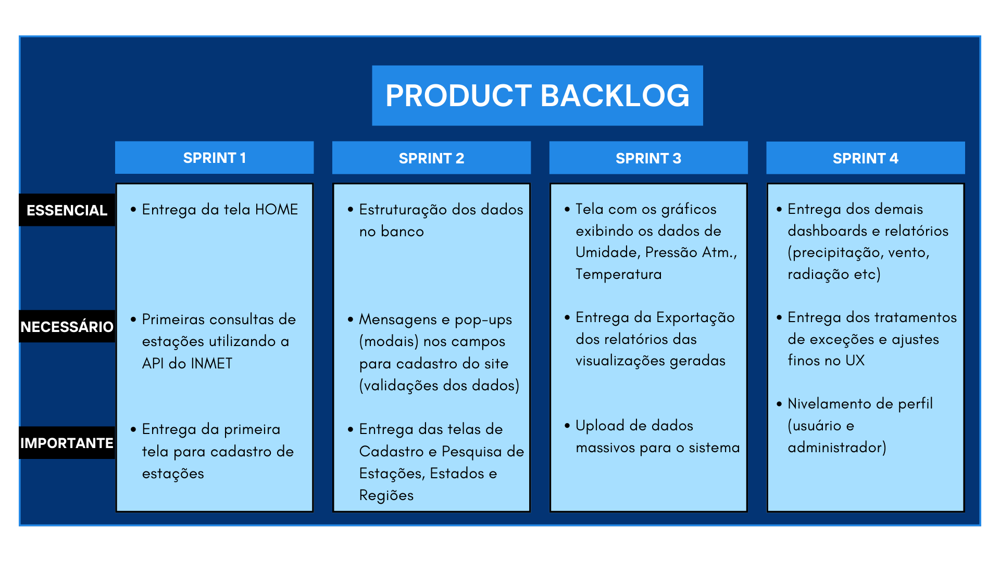

# HexTech - Soluções em Tecnologia

Empresa fictícia criada pelos alunos do 3º Semestre de Banco de Dados da [Fatec SJC - Prof. Jessen Vidal](https://fatecsjc-prd.azurewebsites.net/suporte-moodle.php "Fatec SJC - Prof. Jessen Vidal") para a realização das atividades curriculares e API semestral.

Nosso foco é o desenvolvimento de software, banco de dados e inovações tecnológicas.
 

<h2>Índice</h2>

- [Sobre o grupo](#sobre-o-grupo)
- [Objetivo do Projeto](#objetivo-do-projeto)
- [Manual do usuário (Excutando a aplicação)](#manual-do-usuário-excutando-a-aplicação)
- [Cronograma e Backlog das sprints](#cronograma-e-backlog-das-sprints)
    - [Backlog e cronograma sprint 1](readme_pages/sprint01_backlog_burndown.md)
    - [Backlog e cronograma sprint 2](readme_pages/sprint02_backlog_burndown.md)
    - [Backlog e cronograma sprint 3](readme_pages/sprint03_backlog_burndown.md)
    - [Backlog e cronograma sprint 4](readme_pages/sprint04_backlog_burndown.md)
- [Andamento das atividas por sprint](#andamento-das-atividades)
    - [Andamento Sprint 01](readme_pages/sprint01_atividades_entrega.md)
    - [Andamento Sprint 02](readme_pages/sprint02_atividades_entrega.md)
    - [Andamento Sprint 03](readme_pages/sprint03_atividades_entrega.md)
    - [Andamento Sprint 04](readme_pages/sprint04_atividades_entrega.md)
- [Tecnologias utilizadas](#tecnologias-utilizadas)
 

<h2>Sobre o grupo</h2>

| Scrum Master | PO | Desenvolvedores | 
| ------------------- | ------------------- |  ------------------- | 
| [William David Antoniazzi](mailto:william.antoniazzi@fatec.sp.gov.br "William David Antoniazzi")  | [Luiz Fernando Habaeb](mailto:luiz.habaeb@fatec.sp.gov.br "Luiz Fernando Habaeb")  | [Michel Rubens Silva](mailto:michel.silva33@fatec.sp.gov.br "Michel Rubens Silva")  | 
| | | [Jonathan Willian](mailto:jonathan.alves5@fatec.sp.gov.br "Jonathan Willian")  | 
| | | [Caio Sendreto](mailto:caio.sendreto@fatec.sp.gov.br "Caio Sendreto")  (Desligado) |
| | | [Ruan Macedo](mailto:ruan.macedo@fatec.sp.gov.br "Ruan Macedo")  (Desligado)|
 

<h2>Objetivo do Projeto</h2>

Criação de um sistema web para o cliente [IACIT Soluções Tecnológicas S.A](http://https://www.iacit.com.br/ "IACIT Soluções Tecnológicas S.A").
Uma empresa de consultoria meteorológica que necessitam de um sistema para armazenar seus dados em uma base de dados e com isto oferecer uma plataforma para visualização de dados e gerar relatórios customizados a seus clientes.
 

<h2>Manual do usuário (Excutando a aplicação)</h2>

Todo processo para execução da aplicação está orientado neste manual criado para o cliente.

[Manual do usuário (Excutando a aplicação)](manual_usuario/user_manual.md "Manual do usuário")
 

<h2>Cronograma e Backlog das sprints</h2>

- [Backlog e cronograma sprint 1](readme_pages/sprint01_backlog_burndown.md)
- [Backlog e cronograma sprint 2](readme_pages/sprint02_backlog_burndown.md)
- [Backlog e cronograma sprint 3](readme_pages/sprint03_backlog_burndown.md)
- [Backlog e cronograma sprint 4](readme_pages/sprint04_backlog_burndown.md)
 

<h2>Andamento das atividades</h2>
Nest tópico aprensentamos todo o andamento e trabalho, por sprint, para se obter um funcionalidade nova no projeto como Task, evolução do banco e da programação e também se o que foi planejado foi entregue ao cliente.
 

Nossa proposta é a criação de um sistema como o [WIREFRAME](documents/wireframe_sprint1.pdf "Wireframe_PDF") abaixo:

<table border="0">
    <tr>
        <td></td>
        <td></td>
    </tr>
</table>

- [Andamento Sprint 01](readme_pages/sprint01_atividades_entrega.md)
- [Andamento Sprint 02](readme_pages/sprint02_atividades_entrega.md)
- [Andamento Sprint 03](readme_pages/sprint03_atividades_entrega.md)
- [Andamento Sprint 04](readme_pages/sprint04_atividades_entrega.md)
 

<h2>Tecnologias utilizadas</h2>

Ferramentas utilizadas para desenvolvimento das atividades:

| Comunicação e Versionamento | Banco de Dados | Front end e fluxos | Back End |
| --- | --- | --- | --- |
| [GitHub](https://github.com/) | [PostgreSQL](https://www.enterprisedb.com/downloads/postgres-postgresql-downloads) | [Figma](https://www.figma.com/ "Figma") | [Java JDK](https://www.oracle.com/br/java/technologies/javase/jdk11-archive-downloads.html "Java JDK") |
| [Git](https://git-scm.com/download/win) | [PGAdmin](https://www.pgadmin.org/ "PGAdmin") | [Bootstrap](https://getbootstrap.com/ "Bootstrap") | [Spring](https://start.spring.io/ "Spring") |
| [MS Teams](http://https://www.microsoft.com/pt-br/microsoft-teams/log-in "MS Teams") | [MySQL](https://dev.mysql.com/downloads/mysql/ "MySQL Community") BD para homologação | [jQuery](https://jquery.com/ "jQuery") | [Apache Tomcat](https://tomcat.apache.org/ "Apache Tomcat") |
| | | [JavaScript](https://www.javascript.com/ "JavaScript") | [Springboot](https://spring.io/projects/spring-boot "Springboot") |
| | | [CSS3](https://www.w3schools.com/css/ "CSS3") | [Hibernate](https://hibernate.org/ "Hibernate") |
| | | [HTM5](https://www.w3c.br/pub/Cursos/CursoHTML5/html5-web.pdf "HTML5") | [JPA](https://www.ibm.com/docs/pt-br/was/8.5.5?topic=SSEQTP_8.5.5/com.ibm.websphere.nd.multiplatform.doc/ae/cejb_persistence.html "Java JPA") |
| | | [Thymeleaf](https://www.thymeleaf.org/ "Thymeleaf") | [DEVTools](https://docs.spring.io/spring-boot/docs/1.5.16.RELEASE/reference/html/using-boot-devtools.html "DEVTools") |
| | | [Ajax](https://www.w3schools.com/xml/ajax_intro.asp "AJAX") | |
