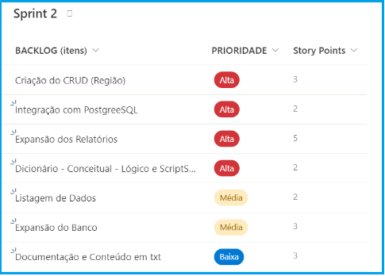
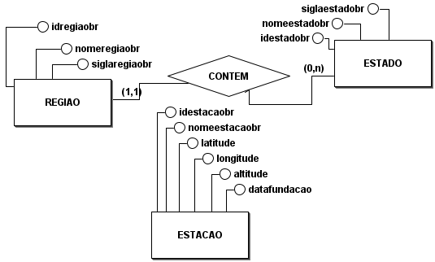
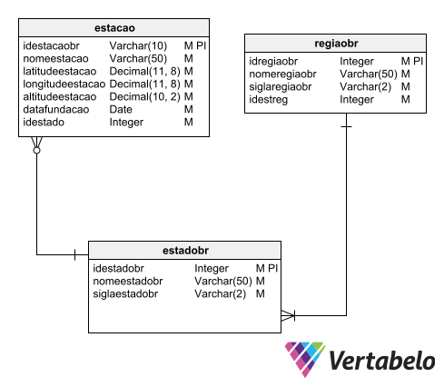

# Crongrama, Backlog do produto e das sprints - SPRINT 02
Nestas páginas divididas por Sprint, poderão ser acompanhadas a evolução da aplicação em uma visão de tarefas realizadas pelo grupo.
 

<h2>Índice</h2>

- [Backlog do produto em Tasks no Jira](#backlog-do-produto-tasks-no-jira)
- [Modelo conceitual e lógico do Banco de Dados](#modelo-conceitual-logico-do-banco-de-dados)
 

<h2>Backlog do produto, Tasks no Jira</h2>

 

<h2>Modelo conceitual e lógico do Banco de Dados</h2>

Modelo conceitual e lógico criado do banco de dados para apresentação da sprint 02.

**Modelo conceitual para a primeira entrega:**

***Modelo lógico para a priomeira entrega:**

 

OBS: Devido a complicações internas não houve entrega desta sprint.
Algumas tarefas foram executadas e serão avalidas na terceira sprint.